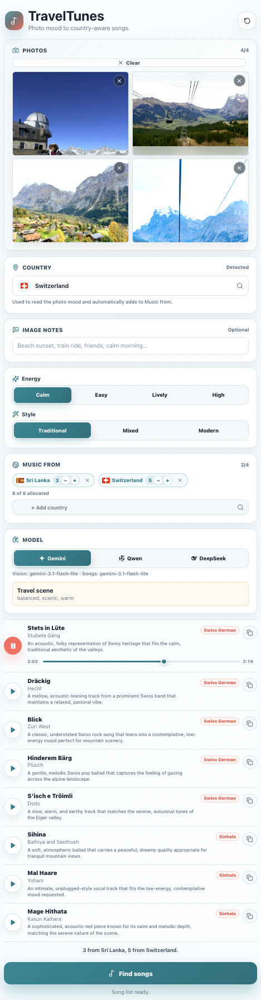

# 🎧 TravelTunes

Photo mood to country-aware songs, wrapped in a clean mobile-first app.

[](https://traveltunes.pages.dev)


## 📋 Requirements

- **Node.js**: v20 or later.
- **Wrangler**: npm scripts pin `wrangler@3.114.14` for compatibility with Node 20 (Wrangler 4 requires Node 22).

## 🌐 Live App

Try it here: **[traveltunes.pages.dev](https://traveltunes.pages.dev)**

## 📱 App Preview

<p align="center">
  
</p>

## ✨ What It Does

- Upload up to 4 travel photos with a dynamic preview layout.
- Detect the photo country from EXIF GPS when available to guide mood analysis.
- Choose which countries the music should come from with a curated list (up to 4 countries maximum).
- Allocate song counts per country with responsive `+` and `−` steppers (e.g. 3 from Sri Lanka, 3 from Japan, 2 from India).
- Tune the vibe with discrete Energy (Calm / Easy / Lively / High) and Style (Traditional / Mixed / Modern) segmented controls.
- Choose Gemini, Qwen, or DeepSeek for photo mood reading and song generation.
- Play songs with lazy on-demand YouTube lookup, caching, and seek timeline.
- Copy individual song names from each result row.
- Runs on Cloudflare Pages + Functions so API keys stay server-side.


## 🧱 Stack

- React 18 + Vite
- Cloudflare Pages + Pages Functions
- Cloudflare D1 (Optional text-only run logs & aggregate geo analytics)
- FlagCDN for lightweight on-demand country flag images
- `@icons-pack/react-simple-icons` for verified AI provider brand marks
- `exifr` for client-side GPS metadata
- OpenStreetMap Nominatim reverse geocoding proxied via `/api/geocode`
- Gemini, Qwen/DashScope, and DeepSeek model routes
- YouTube Data API search with Cloudflare KV caching (`YT_CACHE`)


## 🚀 Local Development

Install dependencies:

```bash
npm install
```

Start the local development server (serves the frontend and routes `/api/*` via Vite dev middleware):

```bash
npm run dev
```

Run with Cloudflare Pages Functions locally using Wrangler (verifies behavior against the real Cloudflare runtime before deploying; note that D1, KV bindings, and `request.cf` exist only here):

```bash
cp .dev.vars.example .dev.vars
npm run cf:dev
```

Add real keys to `.dev.vars` or `.env.local`. These files are ignored by git.

### Verifying Provider Keys

Verify your provider credentials and test both text and vision endpoints:

```bash
npm run check:gemini
npm run check:qwen
npm run check:deepseek
```


## 🔐 Required Env Vars

```text
GEMINI_API_KEY
QWEN_API_KEY or DASHSCOPE_API_KEY
DEEPSEEK_API_KEY
YOUTUBE_API_KEY
```

### Model Defaults & Optional Overrides:

- **Google Gemini**:
  - Required key: `GEMINI_API_KEY`
  - Default model: `gemini-3.1-flash-lite`
  - Overrides: `GEMINI_VISION_MODEL`, `GEMINI_TEXT_MODEL`
- **Alibaba Qwen / DashScope**:
  - Required key: `QWEN_API_KEY` or `DASHSCOPE_API_KEY`
  - Default model: `qwen3.5-flash`
  - Overrides: `QWEN_VISION_MODEL`, `QWEN_TEXT_MODEL`, `QWEN_MODEL`
- **DeepSeek**:
  - Required key: `DEEPSEEK_API_KEY`
  - Default vision model: `deepseek-v4-flash-vision-exp`
  - Default text model: `deepseek-v4-flash`
  - Overrides: `DEEPSEEK_VISION_MODEL`, `DEEPSEEK_TEXT_MODEL`


## 📊 Run Log & Usage Analytics (Cloudflare D1)

TravelTunes includes an optional, text-only run log for debugging prompt quality and model responses.
The log records model outputs, latency, selected countries, and slider values, but never stores photos, image locations, image notes, or IP addresses.
Logging is completely disabled unless the `RUN_LOG` D1 binding is configured.
For full details on data handling and privacy, see [PRIVACY.md](PRIVACY.md); for setup instructions, see [SETUP-D1.md](SETUP-D1.md).

### Setting up D1 (Optional)

1. Create the D1 database:
   ```bash
   npx wrangler@3.114.14 d1 create traveltunes-runs
   ```
2. Uncomment the `[[d1_databases]]` block in `wrangler.toml` and fill in `database_id`.
3. Apply database migrations:
   ```bash
   npm run d1:migrate
   ```

### Querying Logs & Analytics

Query the latest model runs:
```bash
npm run runs:tail
```

Query aggregate daily geography counters:
```bash
npm run geo:tail
```


## 📦 Cloudflare KV Caching

Create the KV namespace for YouTube search results:

```bash
npx wrangler@3.114.14 kv namespace create YT_CACHE
```

Add the generated namespace ID to `wrangler.toml`:

```toml
[[kv_namespaces]]
binding = "YT_CACHE"
id = "<your-namespace-id>"
```


## ☁️ Cloudflare Pages Deploy

Use these Pages build settings:

```text
Build command: npm run build
Output directory: dist
```

> [!NOTE]
> `.dev.vars` and `.env.local` are gitignored and never deployed. Every required API key must be configured in your Cloudflare dashboard under:
> **Cloudflare Pages → Settings → Environment variables**

Every push to GitHub can deploy automatically once the repo is connected.


## 📄 License

This project is licensed under the [MIT License](LICENSE).
